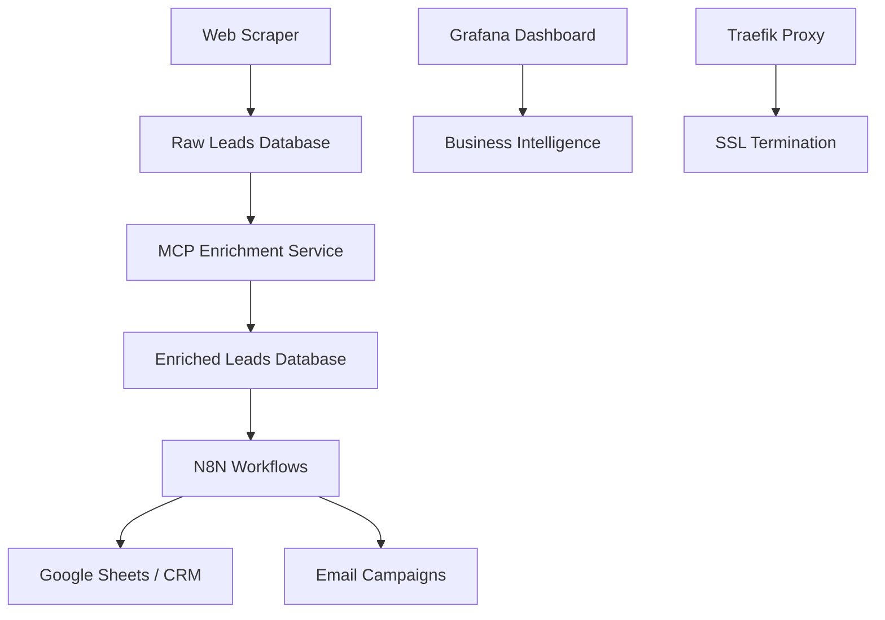

# 🚀 Sales Automation Platform

> Complete end-to-end sales automation system for Mexican PyMEs (Small and Medium Enterprises)

[](https://docker.com)
[](https://postgresql.org)
[](https://n8n.io)
[](https://grafana.com)

## 🎯 Overview

This platform automates the complete sales pipeline for Mexican businesses:

1. **🕷️ Scraper**: Extracts business leads from Yellow Pages (Páginas Amarillas, Sección Amarilla)
2. **🧠 MCP Enrichment**: Enriches leads with emails, founders, scoring using AI
3. **⚡ N8N Workflows**: Orchestrates the entire pipeline with automation
4. **📊 Analytics**: Real-time monitoring and business intelligence dashboard

## 🏗️ Architecture



## 🚀 Quick Start

### Prerequisites

- Docker & Docker Compose
- Domain with DNS access
- 4GB+ RAM, 2+ CPU cores

### 1-Minute Setup

```bash
# Clone the repository
git clone https://github.com/ramonpando/sales-automation-platform.git
cd sales-automation-platform

# Configure environment
cp .env.example .env
nano .env  # Edit with your settings

# Start the entire stack
docker-compose up -d

# Check all services
docker-compose ps
```

### Access Points

| Service | URL | Purpose |
|---------|-----|---------|
| 🕷️ Scraper | `https://scraper.bravix.com.mx` | Lead extraction dashboard |
| 🧠 MCP API | `https://mcp.bravix.com.mx` | Enrichment service API |
| ⚡ N8N | `https://n8n.bravix.com.mx` | Workflow automation |
| 📊 Grafana | `https://monitor.bravix.com.mx` | Analytics dashboard |
| 🔧 Traefik | `https://traefik.bravix.com.mx` | Proxy dashboard |

## 📋 Services

### 🕷️ Web Scraper
- **Target**: Mexican business directories
- **Rate Limited**: Respectful scraping (5 req/sec)
- **Data**: Company name, phone, location, industry
- **Storage**: PostgreSQL with deduplication

### 🧠 MCP Enrichment
- **AI-Powered**: Email generation, founder detection
- **Scoring**: Lead quality scoring (0-100)
- **Sources**: Multiple enrichment strategies
- **Cache**: Redis for performance

### ⚡ N8N Workflows
- **Automation**: End-to-end pipeline orchestration
- **Integrations**: Google Sheets, Email, CRM, Slack
- **Scheduling**: Automated lead processing
- **Error Handling**: Robust retry mechanisms

### 📊 Monitoring
- **Grafana**: Business intelligence dashboard
- **Prometheus**: Metrics collection
- **Alerts**: Slack/Email notifications
- **Health Checks**: Service monitoring

## 🛠️ Configuration

### Environment Variables

```bash
# Database
POSTGRES_PASSWORD=your-secure-password
REDIS_PASSWORD=your-redis-password

# Domain & SSL
ACME_EMAIL=your-email@domain.com

# API Keys
GOOGLE_API_KEY=your-google-api-key
ANTHROPIC_API_KEY=your-claude-api-key

# Monitoring
GRAFANA_USER=admin
GRAFANA_PASSWORD=your-grafana-password
```

### Custom Domains

Update `docker-compose.yml` traefik labels:

```yaml
- "traefik.http.routers.scraper.rule=Host(`your-domain.com`)"
```

## 📈 Scaling

### Horizontal Scaling

```bash
# Scale scraper workers
docker-compose up -d --scale scraper=3

# Scale MCP processing
docker-compose up -d --scale mcp-enrichment=2
```

### Performance Tuning

```bash
# Database optimization
POSTGRES_SHARED_BUFFERS=256MB
POSTGRES_EFFECTIVE_CACHE_SIZE=1GB

# Redis optimization  
REDIS_MAXMEMORY=512mb
REDIS_MAXMEMORY_POLICY=allkeys-lru
```

## 🔧 Development

### Local Development

```bash
# Development mode
docker-compose -f docker-compose.dev.yml up

# Watch logs
docker-compose logs -f scraper mcp-enrichment

# Database access
docker-compose exec postgres psql -U sales_admin -d sales_automation
```

### Adding New Features

1. **Scraper**: Add new sources in `scraper/src/sources/`
2. **MCP**: Extend enrichment in `mcp-enrichment/src/enrichers/`
3. **Workflows**: Create N8N templates in `n8n-workflows/templates/`

## 📊 Analytics & KPIs

### Key Metrics

- **Lead Acquisition Rate**: Leads/day from scraping
- **Enrichment Success**: % of leads successfully enriched
- **Email Discovery**: % of leads with valid emails found
- **Pipeline Conversion**: End-to-end success rate

### Grafana Dashboards

1. **Lead Generation Overview**
2. **Enrichment Performance**
3. **System Health & Performance**
4. **Business Intelligence**

## 🔒 Security

### Best Practices

- **SSL**: Automatic HTTPS with Let's Encrypt
- **Secrets**: Environment-based configuration
- **Network**: Isolated Docker networks
- **Backup**: Automated database backups
- **Monitoring**: Security alerts and logs

### Backup & Recovery

```bash
# Manual backup
docker-compose exec backup ./backup.sh

# Restore from backup
docker-compose exec postgres psql -U sales_admin -d sales_automation < backup.sql
```

## 🤝 Contributing

1. Fork the repository
2. Create feature branch (`git checkout -b feature/amazing-feature`)
3. Commit changes (`git commit -m 'Add amazing feature'`)
4. Push to branch (`git push origin feature/amazing-feature`)
5. Open Pull Request

## 📝 License

This project is licensed under the MIT License - see the [LICENSE](LICENSE) file for details.

## 🎯 Roadmap

- [ ] **WhatsApp Integration**: Automated outreach via WhatsApp Business API
- [ ] **AI Lead Qualification**: Advanced AI-powered lead scoring
- [ ] **Multi-tenancy**: Support for multiple clients/organizations
- [ ] **Mobile App**: React Native app for lead management
- [ ] **Voice Integration**: Twilio integration for automated calls

## 📞 Support

- **Documentation**: [Wiki](https://github.com/ramonpando/sales-automation-platform/wiki)
- **Issues**: [GitHub Issues](https://github.com/ramonpando/sales-automation-platform/issues)
- **Discussions**: [GitHub Discussions](https://github.com/ramonpando/sales-automation-platform/discussions)

---

**Made with ❤️ in Mexico for Mexican businesses**

> Transform your sales process from manual to magical ✨
